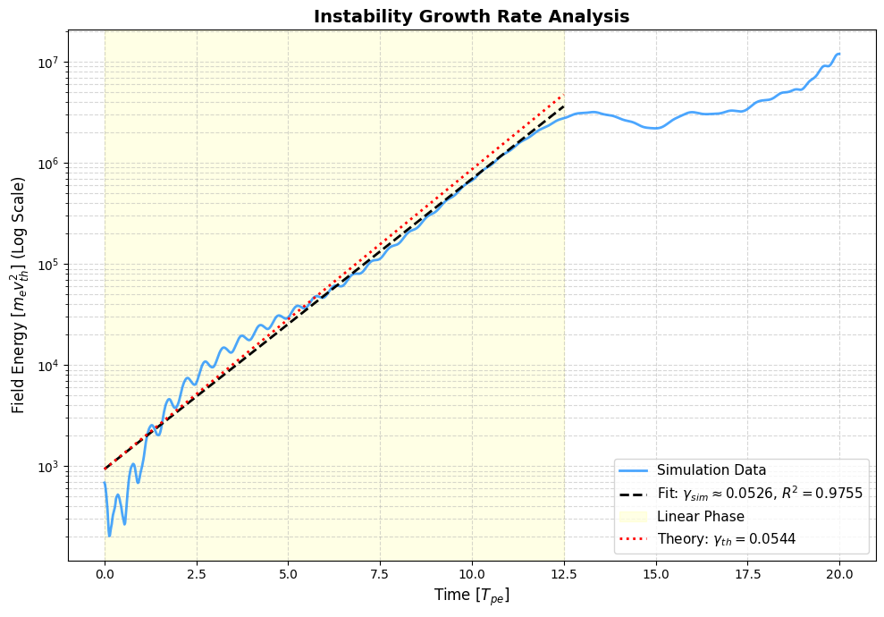

# TwoStreamSimulation


    
<p align="center">
  
</p>

A simple first order weighting PIC simulation for the two stream plasma instability. Here the ions are initially at rest with density equal to the electrons, who have some initial drift velocity.

## Reproducibility

To replicate the results in this repository, please follow the steps below to set up the environment and run the analysis. **NOTE**: The venv was created using Python 3.13.7.

1. **Clone the repository:**
   ```bash
   git clone https://github.com/dTyWick/TwoStreamSimulation.git
   cd TwoStreamSimulation
   ```

2. **Create and activate the virtual environment (named `twoStream`):**
   * **Windows:**
     ```bash
     python -m venv twoStream
     twoStream\Scripts\activate
     ```
   * **macOS / Linux:**
     ```bash
     python3 -m venv twoStream
     source twoStream/bin/activate
     ```

3. **Install dependencies:**
   ```bash
   pip install -r reqs.txt
   ```

4. **Run the code:**
   Launch the Jupyter environment to view the notebooks.
   ```bash
   jupyter lab
   ```

Enjoy!


